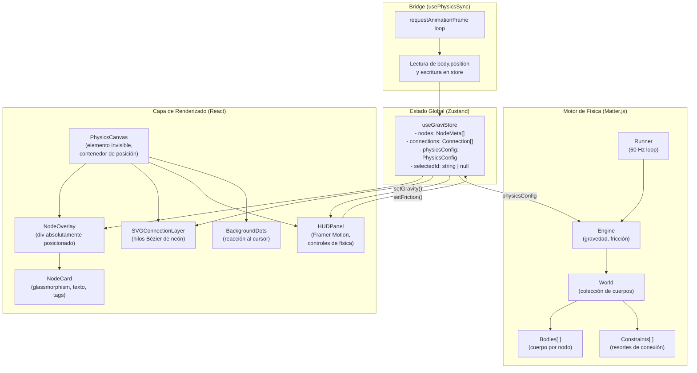

# GraviNote — Especificación de Arquitectura

> **Versión:** 1.1.0  
> **Empresa:** Nothing Sense  
> **Desarrollador Principal:** 5u17im  
> **Fecha:** 13 de julio de 2026

---

## 1. Visión General de la Arquitectura

GraviNote opera sobre dos mundos paralelos que deben estar perfectamente sincronizados:

- **Mundo Físico (Matter.js):** Motor de simulación pura que corre en el hilo principal a 60 ticks/segundo. Desconoce completamente React. Solo trabaja con coordenadas numéricas y vectores de fuerza.
- **Mundo Visual (React DOM):** Componentes de UI que renderizan la apariencia de los nodos. Desconoce Matter.js. Solo consume posiciones absolutas (x, y) y metadata del store.

El **bridge** entre ambos mundos es un bucle `requestAnimationFrame` que, en cada frame, lee las posiciones de los cuerpos de Matter.js y actualiza el store de Zustand con una actualización mínima (solo las coordenadas), disparando así únicamente los re-renders necesarios.

---

## 2. Diagrama de Componentes



---

## 3. Árbol de Carpetas del Proyecto

```
gravinote/
├── public/
│   └── favicon.ico
│
├── src/
│   ├── app/                          # Next.js 16.2.10 App Router
│   │   ├── layout.tsx                # Layout raíz: next/font (self-host), metadatos, tema
│   │   ├── page.tsx                  # Página principal: monta PhysicsCanvas
│   │   └── globals.css               # Variables CSS, reset, tipografía (@theme inline)
│   │
│   ├── components/
│   │   ├── canvas/
│   │   │   ├── PhysicsCanvas.tsx     # Contenedor principal del lienzo (wiring)
│   │   │   ├── NodeOverlay.tsx       # Renderizador de todos los NodeCard
│   │   │   ├── SVGConnectionLayer.tsx# Curvas Bézier para los hilos (refs cacheadas)
│   │   │   ├── BackgroundDots.tsx    # Grilla de puntos reactiva al cursor
│   │   │   └── DemoNodes.ts          # Semilla de nodos de demostración
│   │   │
│   │   ├── nodes/
│   │   │   ├── NodeCard.tsx          # Tarjeta glassmorphism base (a11y: teclado/ARIA)
│   │   │   ├── NodeEditor.tsx        # Modo edición (sanitiza entrada + maxLength)
│   │   │   ├── NodeContextMenu.tsx   # Menú clic derecho
│   │   │   └── registry/
│   │   │       └── index.ts          # CATEGORY_INFO: metadata estática por categoría
│   │   │
│   │   ├── hud/
│   │   │   ├── HUDPanel.tsx          # Panel flotante de controles (emite commandBus)
│   │   │   ├── ConnectionLegend.tsx  # Leyenda de tipos de conexión
│   │   │   └── UndoToast.tsx         # Toast de deshacer eliminación
│   │   │
│   │   ├── particles/
│   │   │   └── DisintegrationEffect.tsx # Sistema de partículas en canvas
│   │   │
│   │   └── welcome/
│   │       └── WelcomeSplash.tsx     # Pantalla de bienvenida inicial
│   │
│   ├── hooks/
│   │   ├── usePhysicsEngine.ts       # Inicializa y destruye el motor Matter.js
│   │   ├── usePhysicsSync.ts         # Bridge RAF: Matter → DOM/SVG (Map + refs)
│   │   ├── useDragNode.ts            # Lógica de arrastre con inercia
│   │   ├── useMagneticForces.ts      # Atracción/repulsión por etiquetas
│   │   ├── useConnectionDraw.ts      # Gestión de creación de conexiones
│   │   └── useCanvasCommands.ts      # Comandos globales (Big Bang, Limpiar, Zoom-Fit)
│   │
│   ├── store/
│   │   ├── useGraviStore.ts          # Compone slices + acciones globales
│   │   └── slices/
│   │       ├── nodesSlice.ts         # CRUD de nodos + selección + undo
│   │       ├── connectionsSlice.ts   # CRUD y ciclo de conexiones
│   │       └── physicsSlice.ts       # Config: gravedad, fricción, magnet, vortex, zoom, pan
│   │
│   ├── physics/
│   │   ├── engine.ts                 # Factory: crea Engine, Runner, World
│   │   ├── bodies.ts                 # Helpers Bodies + tipo NodeBody
│   │   ├── constraints.ts            # Helpers para resortes/constraints
│   │   └── forces.ts                 # Fuerzas magnéticas (spatial hash grid) + vórtice
│   │
│   ├── types/
│   │   └── node.types.ts             # NodeMeta, NodeCategory, Connection, ConnectionType, PhysicsConfig
│   │
│   └── utils/
│       ├── bezier.ts                 # Cálculo de puntos de control Bézier
│       ├── commandBus.ts             # Bus de comandos tipado (reemplaza CustomEvents)
│       ├── dimensions.ts             # Cálculo de dimensiones óptimas de nodo
│       ├── logger.ts                 # Logging solo en desarrollo
│       ├── sanitize.ts               # Saneo y límites de texto libre
│       └── serializer.ts             # Validación/versión + import/export JSON
│
├── vitest.config.ts
├── next.config.ts
├── tsconfig.json
└── package.json
```

---

## 4. El Bridge Matter.js ↔ React: Sin Saturar el Hilo Principal

Este es el punto más crítico de la arquitectura. Un error común es llamar a `setState` en cada frame para cada nodo, lo que genera O(N) re-renders por frame.

### 4.1 Estrategia Adoptada: "Posiciones como Ref, Metadata como State"

```
┌─────────────────────────────────────────────────────────────────┐
│  REGLA DE ORO: Las posiciones (x, y) NUNCA entran en useState.  │
│  Viven en una ref mutable que se lee en cada frame de RAF.      │
└─────────────────────────────────────────────────────────────────┘
```

```typescript
// hooks/usePhysicsSync.ts — Explicación conceptual

// 1. Un Map de bodyId → elemento DOM (ref, no state)
const domRefs = useRef<Map<string, HTMLElement>>(new Map());

// 2. El bucle RAF lee Matter.js y escribe directo al DOM
//    con transform: translate(x, y) — CERO re-renders de React.
const syncLoop = () => {
  for (const [id, body] of physicsBodies.current) {
    const el = domRefs.current.get(id);
    if (el) {
      el.style.transform = `translate(${body.position.x}px, ${body.position.y}px)`;
    }
  }
  rafId.current = requestAnimationFrame(syncLoop);
};
```

**¿Por qué `style.transform` y no `setState`?**

| Técnica | Re-renders por frame | Carga en hilo principal |
|---------|---------------------|------------------------|
| `setState({x, y})` por nodo | O(N) por frame ≈ 3600/seg con 60 nodos | ❌ Alta (crea bottleneck) |
| `element.style.transform` | 0 re-renders | ✅ Mínima (solo GPU) |

Zustand **solo se actualiza** cuando cambia metadata (texto editado, tag agregado, conexión creada) — no en cada frame físico.

### 4.2 Ciclo de Vida del Motor

```
Montaje del componente PhysicsCanvas
          ↓
   usePhysicsEngine() → crea Engine, World, Runner
          ↓
   usePhysicsSync()   → inicia bucle RAF
          ↓
   [Usuario interactúa: crea nodo]
          ↓
   useGraviStore.addNode() → store actualizado
          ↓
   bodies.createBody() → agrega cuerpo a World
          ↓
   DOM ref registrada en domRefs Map
          ↓
   RAF loop detecta nuevo cuerpo y comienza a moverlo
          ↓
   [Desmontaje: useEffect cleanup]
          ↓
   Runner.stop() + Engine.clear() + cancelAnimationFrame()
   → Sin fugas de memoria garantizado
```

---

## 5. Store de Zustand: Diseño de Slices

```typescript
// types/node.types.ts
export type NodeCategory = 'central' | 'idea' | 'tarea' | 'referencia' | 'alerta';

export interface NodeMeta {
  id: string;
  title: string;
  content: string;
  tags: string[];
  category: NodeCategory;
  // Posición INICIAL (para inicializar el cuerpo físico)
  // Luego, la posición "real" vive en Matter.js body.position
  initialX: number;
  initialY: number;
  width: number;
  height: number;
  createdAt: number;
  isPinned?: boolean;   // fija el nodo (cuerpo estático)
  isDeleting?: boolean; // en proceso de succión hacia el vórtice
}

export type ConnectionType = 'neutra' | 'apoyo' | 'conflicto';

export interface Connection {
  id: string;
  sourceId: string;
  targetId: string;
  type: ConnectionType;
  label?: string;
}

export interface PhysicsConfig {
  gravity: number;        // 0 = gravedad cero, 1 = terrestre
  airFriction: number;    // 0.01 default
  magnetStrength: number; // multiplicador de atracción por etiquetas
  zoom: number;           // 1.0 default (clamp 0.15–3.0)
  panX: number;
  panY: number;
  vortexGravity: number;  // fuerza de succión del vórtice (0.1–1.0)
}
```

El store se compone a partir de tres *slices* (`nodesSlice`, `connectionsSlice`, `physicsSlice`) más un conjunto de acciones globales que cruzan slices:

```typescript
// store/useGraviStore.ts — Estructura del store (compuesto)
export type GraviStore = NodesSlice & ConnectionsSlice & PhysicsSlice & GlobalSlice;

// nodesSlice
addNode: (node: Omit<NodeMeta, 'id' | 'createdAt'>) => string;
updateNode: (id: string, patch: Partial<NodeMeta>) => void;
removeNode: (id: string) => void;   // respalda el nodo y sus conexiones (undo)
recoverNode: () => void;            // restaura el último nodo eliminado
selectNode: (id: string | null) => void;

// connectionsSlice
addConnection: (sourceId: string, targetId: string, type?: ConnectionType) => string | null;
removeConnection: (id: string) => void;
cycleConnection: (id: string) => void; // neutra → apoyo → conflicto → neutra

// physicsSlice
setGravity / setAirFriction / setMagnetStrength / setVortexGravity: (val: number) => void;
setPan: (x, y) => void;   // acepta valor o updater funcional
setZoom: (zoom) => void;  // clamp 0.15–3.0

// globalSlice
clearCanvas: () => void;
loadState: (nodes: NodeMeta[], connections: Connection[]) => void;
```

---

## 6. Capa SVG de Conexiones

Los hilos de neón se renderizan en un `<svg>` superpuesto con `position: absolute; inset: 0; pointer-events: none`. Esto permite que los eventos de mouse pasen transparentemente al lienzo.

```typescript
// Cálculo de curva Bézier para conexión elástica
// utils/bezier.ts

export function calcBezierPath(
  ax: number, ay: number,  // posición del nodo A
  bx: number, by: number   // posición del nodo B
): string {
  const dx = bx - ax;
  const dy = by - ay;
  const tension = 0.4;

  const cp1x = ax + dx * tension;
  const cp1y = ay;
  const cp2x = bx - dx * tension;
  const cp2y = by;

  return `M ${ax},${ay} C ${cp1x},${cp1y} ${cp2x},${cp2y} ${bx},${by}`;
}
```

Cada conexión renderiza:
- Un `<path>` grueso translúcido (sombra de neón, `stroke-opacity: 0.3`)
- Un `<path>` delgado sólido encima (el "núcleo" del hilo)

---

## 7. Sistema de Fuerzas Magnéticas

Cada par de nodos se rige por dos fuerzas: **repulsión** de corto alcance (evita solapamientos, siempre activa) y **atracción** de medio alcance (solo si comparten etiquetas). Los nodos de categoría `central` actúan como pozos gravitatorios con atracción 4× más fuerte.

### 7.1 Spatial Hash Grid (rendimiento)

Una comparación ingenua par-a-par es O(N²). En su lugar, `forces.ts` construye una **rejilla espacial** cuyo tamaño de celda equivale al alcance máximo de interacción (`CELL_SIZE = ATTRACTION_DISTANCE`). Así, cualquier par dentro de rango cae en la misma celda o en una adyacente, y solo se comparan celdas vecinas — reduciendo el coste a casi O(N).

```typescript
// physics/forces.ts

const ATTRACTION_DISTANCE = 450;   // px — rango de atracción
const REPULSION_DISTANCE  = 150;   // px — zona de repulsión
const ATTRACTION_BASE_STRENGTH = 0.00008;
const REPULSION_BASE_STRENGTH  = 0.0004;

const CELL_SIZE = ATTRACTION_DISTANCE;

// Para cada celda se comparan solo la propia celda y la "mitad hacia adelante"
// de sus vecinas, de modo que cada par se evalúa exactamente una vez:
const NEIGHBOR_OFFSETS = [
  [0, 0], [1, 0], [-1, 1], [0, 1], [1, 1],
];

export function applyMagneticForces(
  bodies: Map<string, Matter.Body>,
  nodes: NodeMeta[],
  magnetMultiplier: number = 1.0
) { /* construye grid → recorre celdas + vecinos → applyPairForce */ }
```

`applyPairForce` aplica repulsión si `distance < REPULSION_DISTANCE`; en caso contrario, atracción si comparten etiquetas y `distance < ATTRACTION_DISTANCE`. Los cuerpos estáticos (nodos fijados) no reciben fuerza.

### 7.2 Vórtice de Eliminación

`applyVortexSuction` arrastra los nodos marcados con `isDeleting` hacia un agujero negro: desactiva colisiones y constraints, aplica una fuerza de succión radial más una componente tangencial (efecto espiral), ambas escaladas por `vortexGravity`. Al alcanzar la singularidad (`distance < 55`) se invoca el callback de eliminación definitiva.

---

## 8. Sistema de Diseño Visual

### Paleta de Colores Sólidos (sin gradientes en texto)

| Categoría | Color Primario | Uso |
|-----------|---------------|-----|
| Central | pozo gravitatorio (atracción 4×) | Nodo núcleo del mapa |
| Idea | `#00E5FF` (cian) | Borde neón, punto de tag |
| Tarea | `#FFB300` (ámbar) | Borde neón, punto de tag |
| Referencia | `#CE93D8` (violeta) | Borde neón, punto de tag |
| Alerta | `#FF5252` (coral) | Borde neón, punto de tag |
| Fondo | `#0B0F19` | Canvas base |
| Superficie | `rgba(255,255,255,0.04)` | Glassmorphism base |
| Texto principal | `#F0F4FF` | Contenido de notas |
| Texto secundario | `#6B7280` | Tags, timestamps |

> **Regla de Diseño:** El color se aplica a bordes, iconos y acentos estructurales. **Nunca** a palabras o frases mediante gradiente CSS (`background-clip: text`).

---

## 9. Persistencia y Serialización

El estado se persiste en `localStorage` y puede exportarse/importarse como JSON. Todo payload entrante pasa por `validateSnapshot`, que:

- Descarta entradas no interpretables (devuelve `null` si `nodes` no es un array).
- Sanea cada nodo: categoría inválida → `idea`; dimensiones/coordenadas no finitas → valores por defecto; texto y tags saneados con `sanitize.ts`.
- Elimina conexiones que apunten a nodos inexistentes o a sí mismas, y normaliza tipos de conexión inválidos a `neutra`.

`serializeSnapshot` envuelve los datos con metadata versionada (`version: SCHEMA_VERSION`, `app`, `exportedAt`) para compatibilidad futura.

## 10. Bus de Comandos

Los comandos globales del HUD (Big Bang, Limpiar lienzo, Zoom-to-Fit, editar nodo) se despachan mediante un **bus tipado** (`utils/commandBus.ts`) en lugar de `window` CustomEvents. Esto elimina la contaminación del objeto global, aporta seguridad de tipos y facilita las pruebas. `useCanvasCommands` registra los listeners y `HUDPanel` emite los eventos.

## 11. Testing

Pruebas unitarias con **Vitest** (`environment: jsdom`). Cobertura actual:

- `utils/sanitize.test.ts` — saneo y límites de texto.
- `utils/serializer.test.ts` — validación, versionado y round-trip.
- `store/useGraviStore.test.ts` — CRUD, undo, ciclo de conexiones, clamps de física.
- `physics/forces.test.ts` — repulsión, atracción por etiquetas y rejilla espacial.

```bash
npm run test        # ejecución única
npm run test:watch  # modo watch
```

### Tipografía

Las fuentes se cargan con `next/font/google` (auto-hospedadas, sin `@import` en `globals.css`) exponiendo variables CSS: `--font-inter`, `--font-dm-serif`, `--font-jetbrains`.

| Uso | Fuente | Peso |
|-----|--------|------|
| Título de la app / Logotipo | `DM Serif Display` | 400 |
| Contenido de nodos | `Inter` | 400, 500 |
| Tags y metadatos | `JetBrains Mono` | 400 |
| Etiquetas HUD | `Inter` | 500 |

---

*Documento generado por Nothing Sense © 2026 — Desarrollador: 5u17im*
