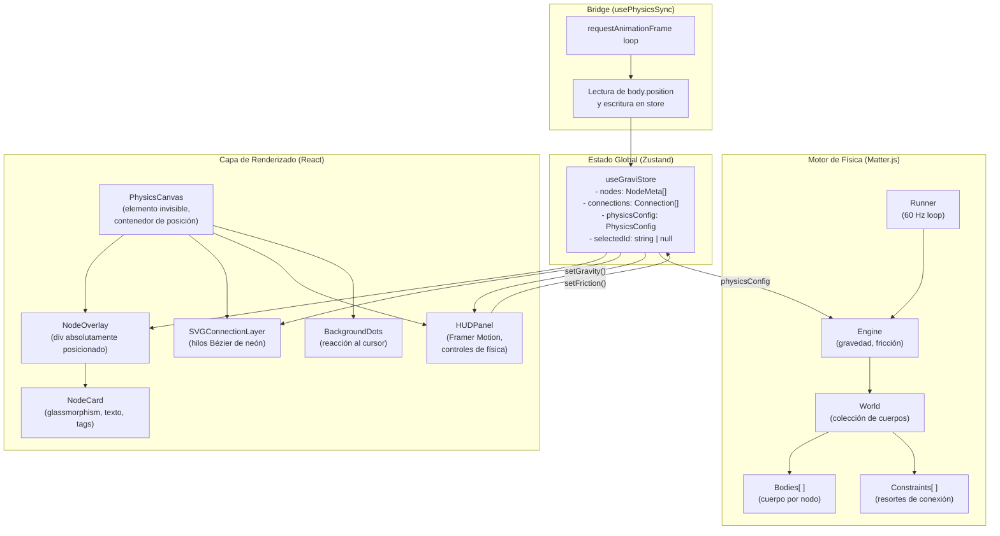

# GraviNote — Especificación de Arquitectura

> **Versión:** 1.0.0  
> **Empresa:** Nothing Sense  
> **Desarrollador Principal:** 5u17im  
> **Fecha:** 10 de julio de 2026

---

## 1. Visión General de la Arquitectura

GraviNote opera sobre dos mundos paralelos que deben estar perfectamente sincronizados:

- **Mundo Físico (Matter.js):** Motor de simulación pura que corre en el hilo principal a 60 ticks/segundo. Desconoce completamente React. Solo trabaja con coordenadas numéricas y vectores de fuerza.
- **Mundo Visual (React DOM):** Componentes de UI que renderizan la apariencia de los nodos. Desconoce Matter.js. Solo consume posiciones absolutas (x, y) y metadata del store.

El **bridge** entre ambos mundos es un bucle `requestAnimationFrame` que, en cada frame, lee las posiciones de los cuerpos de Matter.js y actualiza el store de Zustand con una actualización mínima (solo las coordenadas), disparando así únicamente los re-renders necesarios.

---

## 2. Diagrama de Componentes



---

## 3. Árbol de Carpetas del Proyecto

```
gravinote/
├── public/
│   └── favicon.ico
│
├── src/
│   ├── app/                          # Next.js 16.2.10 App Router
│   │   ├── layout.tsx                # Layout raíz: fuentes, metadatos, tema
│   │   ├── page.tsx                  # Página principal: monta PhysicsCanvas
│   │   └── globals.css               # Variables CSS, reset, tipografía
│   │
│   ├── components/
│   │   ├── canvas/
│   │   │   ├── PhysicsCanvas.tsx     # Contenedor principal del lienzo
│   │   │   ├── NodeOverlay.tsx       # Renderizador de todos los NodeCard
│   │   │   ├── SVGConnectionLayer.tsx# Curvas Bézier para los hilos
│   │   │   └── BackgroundDots.tsx    # Grilla de puntos reactiva al cursor
│   │   │
│   │   ├── nodes/
│   │   │   ├── NodeCard.tsx          # Tarjeta glassmorphism base
│   │   │   ├── NodeEditor.tsx        # Modo edición de una tarjeta
│   │   │   ├── NodeContextMenu.tsx   # Menú clic derecho
│   │   │   └── registry/
│   │   │       ├── index.ts          # NODE_REGISTRY: exporta todos los tipos
│   │   │       ├── IdeaNode.tsx      # Tipo: Idea (cian)
│   │   │       ├── TaskNode.tsx      # Tipo: Tarea (ámbar)
│   │   │       ├── ReferenceNode.tsx # Tipo: Referencia (violeta)
│   │   │       └── AlertNode.tsx     # Tipo: Alerta (coral)
│   │   │
│   │   ├── hud/
│   │   │   ├── HUDPanel.tsx          # Panel flotante de controles
│   │   │   ├── GravitySlider.tsx     # Control de gravedad 0–1
│   │   │   ├── FrictionSlider.tsx    # Control de fricción de aire
│   │   │   └── HUDActions.tsx        # Botones: Big Bang, Limpiar, Exportar
│   │   │
│   │   └── particles/
│   │       └── DisintegrationEffect.tsx # Sistema de partículas en canvas
│   │
│   ├── hooks/
│   │   ├── usePhysicsEngine.ts       # Inicializa y destruye el motor Matter.js
│   │   ├── usePhysicsSync.ts         # Bridge RAF: Matter → Zustand
│   │   ├── useDragNode.ts            # Lógica de arrastre con inercia
│   │   ├── useMagneticForces.ts      # Atracción/repulsión por etiquetas
│   │   └── useConnectionDraw.ts      # Gestión de creación de conexiones
│   │
│   ├── store/
│   │   ├── useGraviStore.ts          # Store principal de Zustand
│   │   └── slices/
│   │       ├── nodesSlice.ts         # CRUD de nodos
│   │       ├── connectionsSlice.ts   # CRUD de conexiones
│   │       └── physicsSlice.ts       # Config: gravedad, fricción, zoom
│   │
│   ├── physics/
│   │   ├── engine.ts                 # Factory: crea Engine, Runner, World
│   │   ├── bodies.ts                 # Helpers para crear/destruir Bodies
│   │   ├── constraints.ts            # Helpers para resortes/constraints
│   │   └── forces.ts                 # Funciones de atracción y repulsión
│   │
│   ├── types/
│   │   ├── node.types.ts             # NodeMeta, NodeCategory, NodeType
│   │   ├── connection.types.ts       # Connection, BezierPath
│   │   └── physics.types.ts          # PhysicsConfig, BodyRef
│   │
│   └── utils/
│       ├── idGenerator.ts            # nanoid wrapper
│       ├── colorMap.ts               # Categoría → color sólido neón
│       ├── bezier.ts                 # Cálculo de puntos de control Bézier
│       └── serializer.ts             # JSON export/import del estado
│
├── next.config.ts
├── tailwind.config.ts
├── tsconfig.json
└── package.json
```

---

## 4. El Bridge Matter.js ↔ React: Sin Saturar el Hilo Principal

Este es el punto más crítico de la arquitectura. Un error común es llamar a `setState` en cada frame para cada nodo, lo que genera O(N) re-renders por frame.

### 4.1 Estrategia Adoptada: "Posiciones como Ref, Metadata como State"

```
┌─────────────────────────────────────────────────────────────────┐
│  REGLA DE ORO: Las posiciones (x, y) NUNCA entran en useState.  │
│  Viven en una ref mutable que se lee en cada frame de RAF.      │
└─────────────────────────────────────────────────────────────────┘
```

```typescript
// hooks/usePhysicsSync.ts — Explicación conceptual

// 1. Un Map de bodyId → elemento DOM (ref, no state)
const domRefs = useRef<Map<string, HTMLElement>>(new Map());

// 2. El bucle RAF lee Matter.js y escribe directo al DOM
//    con transform: translate(x, y) — CERO re-renders de React.
const syncLoop = () => {
  for (const [id, body] of physicsBodies.current) {
    const el = domRefs.current.get(id);
    if (el) {
      el.style.transform = `translate(${body.position.x}px, ${body.position.y}px)`;
    }
  }
  rafId.current = requestAnimationFrame(syncLoop);
};
```

**¿Por qué `style.transform` y no `setState`?**

| Técnica | Re-renders por frame | Carga en hilo principal |
|---------|---------------------|------------------------|
| `setState({x, y})` por nodo | O(N) por frame ≈ 3600/seg con 60 nodos | ❌ Alta (crea bottleneck) |
| `element.style.transform` | 0 re-renders | ✅ Mínima (solo GPU) |

Zustand **solo se actualiza** cuando cambia metadata (texto editado, tag agregado, conexión creada) — no en cada frame físico.

### 4.2 Ciclo de Vida del Motor

```
Montaje del componente PhysicsCanvas
          ↓
   usePhysicsEngine() → crea Engine, World, Runner
          ↓
   usePhysicsSync()   → inicia bucle RAF
          ↓
   [Usuario interactúa: crea nodo]
          ↓
   useGraviStore.addNode() → store actualizado
          ↓
   bodies.createBody() → agrega cuerpo a World
          ↓
   DOM ref registrada en domRefs Map
          ↓
   RAF loop detecta nuevo cuerpo y comienza a moverlo
          ↓
   [Desmontaje: useEffect cleanup]
          ↓
   Runner.stop() + Engine.clear() + cancelAnimationFrame()
   → Sin fugas de memoria garantizado
```

---

## 5. Store de Zustand: Diseño de Slices

```typescript
// types/node.types.ts
export type NodeCategory = 'idea' | 'tarea' | 'referencia' | 'alerta';

export interface NodeMeta {
  id: string;
  content: string;
  tags: string[];
  category: NodeCategory;
  // Posición INICIAL (para inicializar el cuerpo físico)
  // Luego, la posición "real" vive en Matter.js body.position
  initialX: number;
  initialY: number;
  width: number;
  height: number;
  createdAt: number;
}

export interface Connection {
  id: string;
  sourceId: string;
  targetId: string;
  label?: string;
}

// store/useGraviStore.ts — Estructura del store
interface GraviStore {
  // Estado
  nodes: NodeMeta[];
  connections: Connection[];
  selectedId: string | null;
  physicsConfig: {
    gravity: number;      // 0 = gravedad cero, 1 = terrestre
    airFriction: number;  // 0.01 default
    magnetStrength: number;
  };

  // Acciones de nodos
  addNode: (node: Omit<NodeMeta, 'id' | 'createdAt'>) => void;
  updateNode: (id: string, patch: Partial<NodeMeta>) => void;
  removeNode: (id: string) => void;
  selectNode: (id: string | null) => void;

  // Acciones de conexiones
  addConnection: (sourceId: string, targetId: string) => void;
  removeConnection: (id: string) => void;

  // Acciones de física
  setGravity: (value: number) => void;
  setAirFriction: (value: number) => void;
  setMagnetStrength: (value: number) => void;

  // Acciones globales
  clearCanvas: () => void;
  importState: (snapshot: GraviSnapshot) => void;
  exportState: () => GraviSnapshot;
}
```

---

## 6. Capa SVG de Conexiones

Los hilos de neón se renderizan en un `<svg>` superpuesto con `position: absolute; inset: 0; pointer-events: none`. Esto permite que los eventos de mouse pasen transparentemente al lienzo.

```typescript
// Cálculo de curva Bézier para conexión elástica
// utils/bezier.ts

export function calcBezierPath(
  ax: number, ay: number,  // posición del nodo A
  bx: number, by: number   // posición del nodo B
): string {
  const dx = bx - ax;
  const dy = by - ay;
  const tension = 0.4;

  const cp1x = ax + dx * tension;
  const cp1y = ay;
  const cp2x = bx - dx * tension;
  const cp2y = by;

  return `M ${ax},${ay} C ${cp1x},${cp1y} ${cp2x},${cp2y} ${bx},${by}`;
}
```

Cada conexión renderiza:
- Un `<path>` grueso translúcido (sombra de neón, `stroke-opacity: 0.3`)
- Un `<path>` delgado sólido encima (el "núcleo" del hilo)

---

## 7. Sistema de Fuerzas Magnéticas

```typescript
// physics/forces.ts

const ATTRACTION_DISTANCE = 400;  // px — rango de atracción
const REPULSION_DISTANCE  = 120;  // px — zona de repulsión
const ATTRACTION_STRENGTH = 0.00008;
const REPULSION_STRENGTH  = 0.0003;

export function applyMagneticForces(
  bodies: Map<string, Matter.Body>,
  nodes: NodeMeta[]
) {
  for (let i = 0; i < nodes.length; i++) {
    for (let j = i + 1; j < nodes.length; j++) {
      const nodeA = nodes[i];
      const nodeB = nodes[j];

      // ¿Comparten alguna etiqueta?
      const sharedTags = nodeA.tags.some(t => nodeB.tags.includes(t));
      if (!sharedTags) continue;

      const bodyA = bodies.get(nodeA.id);
      const bodyB = bodies.get(nodeB.id);
      if (!bodyA || !bodyB) continue;

      const dx = bodyB.position.x - bodyA.position.x;
      const dy = bodyB.position.y - bodyA.position.y;
      const distance = Math.sqrt(dx * dx + dy * dy);

      if (distance < REPULSION_DISTANCE) {
        // Repulsión: alejar
        const fx = -(dx / distance) * REPULSION_STRENGTH;
        const fy = -(dy / distance) * REPULSION_STRENGTH;
        Matter.Body.applyForce(bodyA, bodyA.position, { x: -fx, y: -fy });
        Matter.Body.applyForce(bodyB, bodyB.position, { x: fx, y: fy });
      } else if (distance < ATTRACTION_DISTANCE) {
        // Atracción: acercar
        const fx = (dx / distance) * ATTRACTION_STRENGTH;
        const fy = (dy / distance) * ATTRACTION_STRENGTH;
        Matter.Body.applyForce(bodyA, bodyA.position, { x: fx, y: fy });
        Matter.Body.applyForce(bodyB, bodyB.position, { x: -fx, y: -fy });
      }
    }
  }
}
```

---

## 8. Sistema de Diseño Visual

### Paleta de Colores Sólidos (sin gradientes en texto)

| Categoría | Color Primario | Uso |
|-----------|---------------|-----|
| Idea | `#00E5FF` (cian) | Borde neón, punto de tag |
| Tarea | `#FFB300` (ámbar) | Borde neón, punto de tag |
| Referencia | `#CE93D8` (violeta) | Borde neón, punto de tag |
| Alerta | `#FF5252` (coral) | Borde neón, punto de tag |
| Fondo | `#0B0F19` | Canvas base |
| Superficie | `rgba(255,255,255,0.04)` | Glassmorphism base |
| Texto principal | `#F0F4FF` | Contenido de notas |
| Texto secundario | `#6B7280` | Tags, timestamps |

> **Regla de Diseño:** El color se aplica a bordes, iconos y acentos estructurales. **Nunca** a palabras o frases mediante gradiente CSS (`background-clip: text`).

### Tipografía

| Uso | Fuente | Peso |
|-----|--------|------|
| Título de la app / Logotipo | `DM Serif Display` | 400 |
| Contenido de nodos | `Inter` | 400, 500 |
| Tags y metadatos | `JetBrains Mono` | 400 |
| Etiquetas HUD | `Inter` | 500 |

---

*Documento generado por Nothing Sense © 2026 — Desarrollador: 5u17im*
